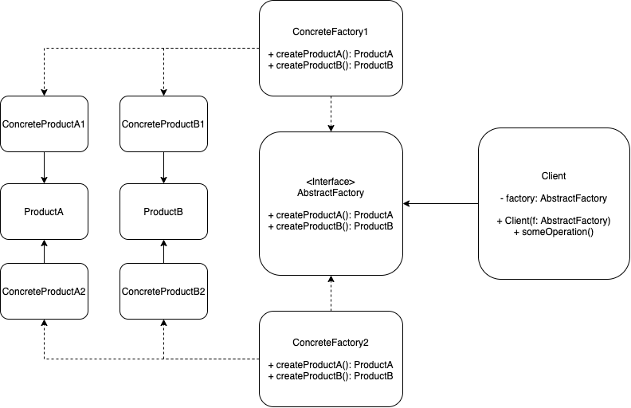

# Observer Pattern

## Problem:
Imagine that you’re creating a furniture shop simulator. Your code consists of classes that represent:

A family of related products, say: Chair + Sofa + CoffeeTable. Several variants of this family. For example, products Chair + Sofa + CoffeeTable are available in these variants: Modern, Victorian, ArtDeco

## Solution:
The first thing the Abstract Factory pattern suggests is to explicitly declare interfaces for each distinct product of the product family (e.g., chair, sofa or coffee table). Then you can make all variants of products follow those interfaces. 

The next move is to declare the Abstract Factory—an interface with a list of creation methods for all products that are part of the product family (for example, createChair, createSofa and createCoffeeTable). These methods must return abstract product types represented by the interfaces we extracted previously: Chair, Sofa, CoffeeTable and so on.

Now, how about the product variants? For each variant of a product family, we create a separate factory class based on the AbstractFactory interface. A factory is a class that returns products of a particular kind. For example, the ModernFurnitureFactory can only create ModernChair, ModernSofa and ModernCoffeeTable objects.

## Applicability:
* Use the Abstract Factory when your code needs to work with various families of related products, but you don’t want it to depend on the concrete classes of those products—they might be unknown beforehand or you simply want to allow for future extensibility. The Abstract Factory provides you with an interface for creating objects from each class of the product family. As long as your code creates objects via this interface, you don’t have to worry about creating the wrong variant of a product which doesn’t match the products already created by your app. In a well-designed program each class is responsible only for one thing. When a class deals with multiple product types, it may be worth extracting its factory methods into a stand-alone factory class or a full-blown Abstract Factory implementation.

## Implement:
1. Declare abstract product interfaces for all product types. Then make all concrete product classes implement these interfaces.
2. Declare the abstract factory interface with a set of creation methods for all abstract products.
3. Implement a set of concrete factory classes, one for each product variant.
4. Create factory initialization code somewhere in the app. It should instantiate one of the concrete factory classes, depending on the application configuration or the current environment. Pass this factory object to all classes that construct products.

## Structure:
