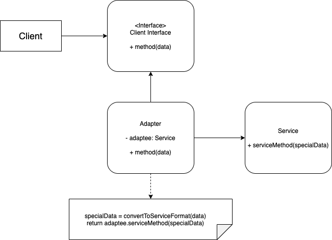

# Adapter Pattern

## Problem:
You have some code already running or there's some third party library you want to use. However, to use some other part of the code, you have to modify the existing code. Also, you might not have access to change third party code.

## Solution:
Instead, you can create an adapter. A special object convert the interface of one object so that another object can use it. An adapter wraps one of the object, and convert the result.
* The adapter gets an interface, compatible with one of the existing objects.
* Using this interface, the existing object can safely call the adapter’s methods.
* Upon receiving a call, the adapter passes the request to the second object, but in a format and order that the second object expects.

## Applicability:
* Use the Adapter class when you want to use some existing class, but its interface isn’t compatible with the rest of your code.

* Use the pattern when you want to reuse several existing subclasses that lack some common functionality that can’t be added to the superclass. This approach looks very similar to the Decorator pattern.

## Implement:
1. Two classes with incompatible interfaces.
2. Declare the client interface and describe how clients communicate with the service.
3. Create the adapter class and make it follow the client interface.
4. Add a field to the adapter class to store a reference to the service object. 
5. One by one, implement all methods of the client interface in the adapter class. The adapter should delegate most of the real work to the service object, handling only the interface or data format conversion.

## Structure:
