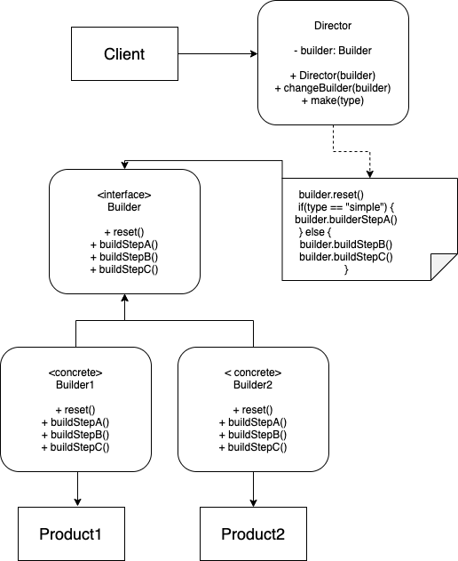

# Builder Pattern

## Problem:
You need to represent a robot with your object structure. The robot can be humanoid with four limbs and upward standing, or it can be animal-like with a tail, wings, etc.

It can use wheels to move, or it can use helicopter blades. It can use cameras, an infrared detection module... you get the picture.

Imagine the constructor for this thing:
```
def __init__(self, left_leg, right_leg, left_arm, right_arm,
             left_wing, right_wing, tail, blades, cameras,
             infrared_module, #...
             ):
    self.left_leg = left_leg
    if left_leg == None:
        bipedal = False
    self.right_leg = right_leg
    self.left_arm = left_arm
    self.right_arm = right_arm
    # ...
```

## Solution:
We can make a Builder class that constructs our object and adds appropriate modules to our robot. Instead of a convoluted constructor, we can instantiate an object and add the needed components using functions. The important part is that you don’t need to call all of the steps. You can call only those steps that are necessary for producing a particular configuration of an object.

## Applicability:
* Use the Builder pattern to get rid of a “telescopic constructor”. The Builder pattern lets you build objects step by step, using only those steps that you really need. After implementing the pattern, you don’t have to cram dozens of parameters into your constructors anymore.

* Use the Builder pattern when you want your code to be able to create different representations of some product (for example, stone and wooden houses). The Builder pattern can be applied when construction of various representations of the product involves similar steps that differ only in the details.

## Implement:
1. Make sure that you can clearly define the common construction steps for building all available product representations.
2. Declare these steps in the base builder interface.
3. Create a concrete builder class for each of the product representations and implement their construction steps.
4. Think about creating a director class. It may encapsulate various ways to construct a product using the same builder object.
5. The client code creates both the builder and the director objects. Before construction starts, the client must pass a builder object to the director. Usually, the client does this only once, via parameters of the director’s constructor. The director uses the builder object in all further construction.

## Structure:
