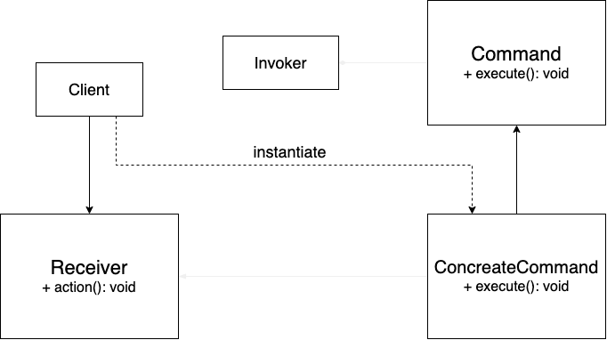

# Command Pattern

## Problem:
Need to issue requests to objects without knowing anything about the operation being requested or the receiver of the request.

## Solution:
Instead, you should extract all of the request details, such as the object being called, the name of the method and the list of arguments into a separate command class with a single method that triggers this request. In the Command pattern, the Invoker is decoupled from the action performed by the Receiver. The Invoker has no knowledge of the Receiver. The Invoker invokes a Command, and the Command executes the appropriate action of the Receiver. Thus, the Invoker can invoke commands without knowing the details of the action to be performed. In addition, this decoupling means that changes to the receiver’s action don’t directly affect the invocation of the action.

## Applicability:
* When don't know beforehand the exact types and dependencies of the objects going to work with.

* When want to provide users of the library with a way to extend its internal components.

## Implement:
1. When want to parametrize objects with operations. 
2. Queue operations, schedule their execution, or execute them remotely.
3. Implement reversible operations.

## Structure:
