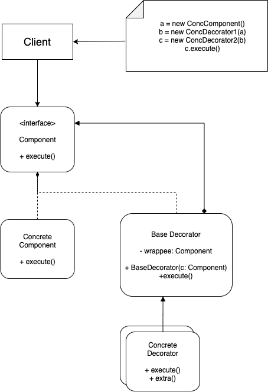

# Decorator Pattern

## Problem:
The first version of the code can only send email to notify message. Then add new method like slack and facebook. Here comes the issue when trying to send message with combined methods. Extending a class is the first thing that comes to mind when you need to alter an object’s behavior. However, inheritance has several serious caveats that you need to be aware of.
* Inheritance is static. You can’t alter the behavior of an existing object at runtime. You can only replace the whole object with another one that’s created from a different subclass.
* Subclasses can have just one parent class. In most languages, inheritance doesn’t let a class inherit behaviors of multiple classes at the same time.

## Solution:
One object has a reference to another and delegates it some work, whereas with inheritance, the object itself is able to do that work, inheriting the behavior from its superclass.
A wrapper is an object that can be linked with some target object. The wrapper contains the same set of methods as the target and delegates to it all requests it receives. However, the wrapper may alter the result by doing something either before or after it passes the request to the target.

## Applicability:
* Use the Decorator pattern when you need to be able to assign extra behaviors to objects at runtime without breaking the code that uses these objects.

* Use the pattern when it’s awkward or not possible to extend an object’s behavior using inheritance.

## Implement:
1. Figure out what methods are common to both the primary component and the optional layers. Create a component interface and declare those methods there.
2. Create a concrete component class and define the base behavior in it.
3. Create a base decorator class. It should have a field for storing a reference to a wrapped object. The field should be declared with the component interface type to allow linking to concrete components as well as decorators. The base decorator must delegate all work to the wrapped object.
4. Make sure all classes implement the component interface.
5. Create concrete decorators by extending them from the base decorator. A concrete decorator must execute its behavior before or after the call to the parent method (which always delegates to the wrapped object).
6. The client code must be responsible for creating decorators and composing them in the way the client needs.

## Structure:
