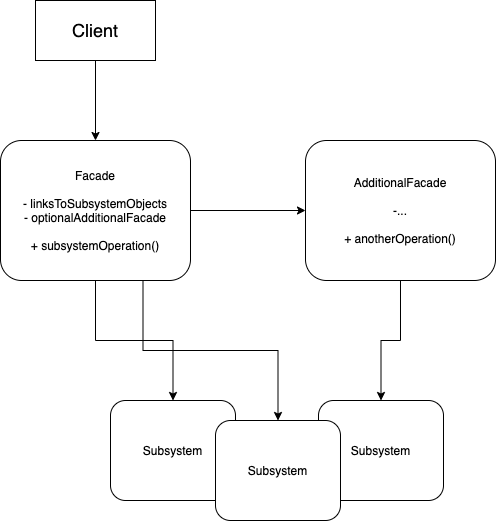

# Facade Pattern

## Problem:
Imagine that you must make your code work with a broad set of objects that belong to a sophisticated library or framework. Ordinarily, you’d need to initialize all of those objects, keep track of dependencies, execute methods in the correct order, and so on.

As a result, the business logic of your classes would become tightly coupled to the implementation details of 3rd-party classes, making it hard to comprehend and maintain.

## Solution:
A facade is a class that provides a simple interface to a complex subsystem which contains lots of moving parts. A facade might provide limited functionality in comparison to working with the subsystem directly. However, it includes only those features that clients really care about.

Facebook-sdk library to user facebook APIs. It provides very easy and simple methods to access all the REST APIs in pythonic way. So this library is a facade.

## Applicability:
* Use the Facade pattern when you need to have a limited but straightforward interface to a complex subsystem.

* Use the Facade when you want to structure a subsystem into layers. Create facades to define entry points to each level of a subsystem. You can reduce coupling between multiple subsystems by requiring them to communicate only through facades.

## Implement:
1. Check whether it’s possible to provide a simpler interface than what an existing subsystem already provides. You’re on the right track if this interface makes the client code independent from many of the subsystem’s classes.
2. Declare and implement this interface in a new facade class. The facade should redirect the calls from the client code to appropriate objects of the subsystem. The facade should be responsible for initializing the subsystem and managing its further life cycle unless the client code already does this.
3. To get the full benefit from the pattern, make all the client code communicate with the subsystem only via the facade.
4. If the facade becomes too big, consider extracting part of its behavior to a new, refined facade class.

## Structure:
