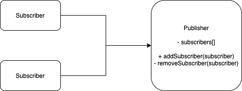

# Observer Pattern

## Problem:
Customer wastes time checking product availability or the store wastes resources notifying the wrong customers.

## Solution:
The Observer pattern suggests that you add a subscription mechanism to the publisher class so individual objects can subscribe to or unsubscribe from a stream of events coming from that publisher. Now, whenever an important event happens to the publisher, it goes over its subscribers and calls the specific notification method on their objects. (Cons: Subscribers are notified in random order.)

## Applicability:
* Use the Observer pattern when changes to the state of one object may require changing other objects, and the actual set of objects is unknown beforehand or changes dynamically.

* Use the pattern when some objects in your app must observe others, but only for a limited time or in specific cases. The subscription list is dynamic, so subscribers can join or leave the list whenever they need to.

## Implement:
1. Break code down into two parts: the core functionality, independent from other code, will act as the publisher; the rest will turn into a set of subscriber classes.
2. Declare the subscriber interface. At a bare minimum, it should declare a single update method.
3. Declare the publisher interface and describe a pair of methods for adding a subscriber object to and removing it from the list. Remember that publishers must work with subscribers only via the subscriber interface.
4. Create concrete publisher classes. Each time something important happens inside a publisher, it must notify all its subscribers.
5. Implement the update notification methods in concrete subscriber classes.

## Structure:
