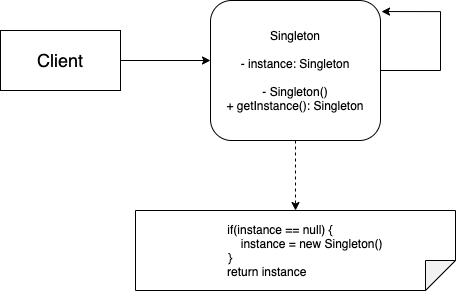

# Singleton Pattern

## Problem:
The most common reason for this is to control access to some shared resource—for example, a database or a file. Note that this behavior is impossible to implement with a regular constructor since a constructor call must always return a new object by design. Also those global variables that used to store some essential objects. While they’re very handy, they’re also very unsafe since any code can potentially overwrite the contents of those variables and crash the app.

## Solution:
All implementations of the Singleton have these two steps in common:
* Make the default constructor private, to prevent other objects from using the new operator with the Singleton class.
* Create a static creation method that acts as a constructor. Under the hood, this method calls the private constructor to create an object and saves it in a static field. All following calls to this method return the cached object.

## Applicability:
* Use the Singleton pattern when a class in your program should have just a single instance available to all clients; for example, a single database object shared by different parts of the program.

* Use the Singleton pattern when you need stricter control over global variables.

## Implement:
1. Add a private static field to the class for storing the singleton instance.
2. Declare a public static creation method for getting the singleton instance.
3. Implement “lazy initialization” inside the static method. It should create a new object on its first call and put it into the static field. The method should always return that instance on all subsequent calls.
4. Make the constructor of the class private. The static method of the class will still be able to call the constructor, but not the other objects.
5. Go over the client code and replace all direct calls to the singleton’s constructor with calls to its static creation method.

## Structure:
